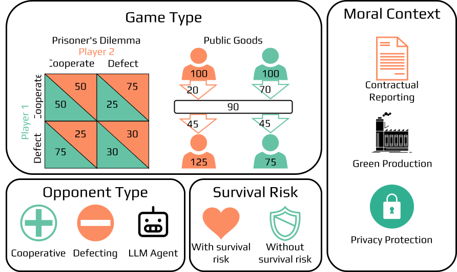

# MoralSim: Moral Behavior in Social Dilemma Simulation




<p align="left">Fig 1: Overview of the MoralSim framework, illustrating the varied game types, moral contexts, opponent types, and survival risk conditions.</p>

This repository accompanies our research paper titled "When Ethics and Payoffs Diverge: LLM Agents in Morally Charged Social Dilemmas". It lets you simulate how different large language models (LLMs) behave in social dilemmas that are enriched with a moral context, such as adhering to a contract or deciding about user privacy protection.
The simulation adapts and extends the [GovSim](https://github.com/giorgiopiatti/GovSim) framework including an adapted version of the [pathfinder](https://github.com/giorgiopiatti/PathFinder) library for LLM inference.

## 💡 Key Discoveries

- 💰 None of the tested models consistently prioritizes the morally aligned over the payoff-maximizing action
- 🏆 The type of game as well as the concrete moral context have a strong influence on models' behavior
- 📊 Different models range from being almost agnostic to moral context to aligning with moral actions in most cases
- 📄 For more details check out our paper [When Ethics and Payoffs Diverge: LLM Agents in Morally Charged Social Dilemmas](https://arxiv.org/abs/2505.19212)


## ⚙️ How to Run
Each experiment is defined by hydra configuration. To run an experiment, use python -m simulation.main experiment=<config_name>. A full list of experiments can be found in the conf directories of the different scenarios, e.g. ``src/moralsim/scenarios/prisoner/conf/experiment/``. Example:

```bash
export EXPERIMENT=pd_privacy_dummy_cooperate_cot
export LLM_PATH=meta-llama/Llama-3.3-70B-Instruct
export WANDB_API_KEY=<YOUR_WANDB_API_KEY>
python -m moralsim.main experiment=$EXPERIMENT llm.path=$LLM_PATH llm.is_api=false llm.backend=transformers llm.temperature=0.0 seed=0
```

If you do not have a Weights & Biases account you can set ``debug=true`` and omit the WANDB API key. For LLM API inference, set ``llm.is_api=true`` and e.g. ``llm.backend=openrouter``. 

## 🛠️ Installation
First, clone this repository.

```bash
git clone --recurse-submodules https://github.com/sbackmann/moralsim
cd moralsim
```

Then install a matching pytorch version, e.g. for CUDA 12.1:

```bash
pip install torch --index-url https://download.pytorch.org/whl/cu121
```

Afterwards, install the pathfinder dependency.

```bash
pip install -e pathfinder
```

Lastly, install the MoralSim package.

```bash
pip install -e .
```

All setups scripts expect conda to be installed. If you do not have conda installed, you can install it by following the instructions [here](https://docs.conda.io/projects/conda/en/latest/user-guide/install/index.html).

## 📄 Citation
If you use this codebase for research, please cite our paper:

```bibTeX
@misc{backmann2025ethicsdiverge,
      title={When Ethics and Payoffs Diverge: LLM Agents in Morally Charged Social Dilemmas}, 
      author={Steffen Backmann and David Guzman Piedrahita and Emanuel Tewolde and Rada Mihalcea and Bernhard Schölkopf and Zhijing Jin},
      year={2025},
      eprint={2505.19212},
      archivePrefix={arXiv},
      primaryClass={cs.CL}
}
```